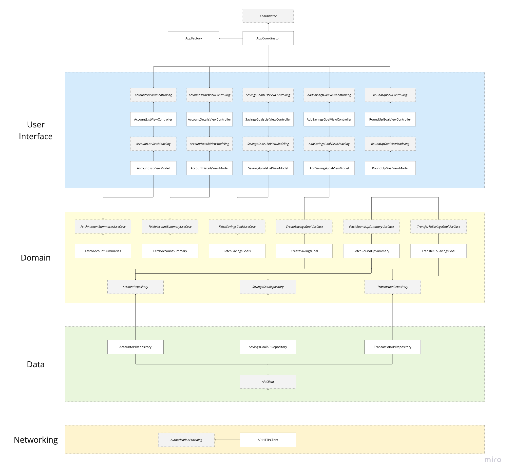

# Project Summary

## Getting Up and Running

### Prerequisites

* A Starling sandboxed Account and Application setup
* Used `auto-simulate` to generate transaction test data
* A generated access token for your sandboxed user for the sandboxed
Application

### Update App Configuration

Open [Development.xcconfig](../Development.xcconfig) and set the
`API_ACCESS_TOKEN` variable to your access token generated above

### Run the App

Open the Xcode project file and run the app

### Running Tests

There are three TestPlans in the project:

* `StarlingRoundUp` - Unit tests
* `StaringRoundUpSnapshots` - Snapshot tests
* `StarlingRoundUpUI` - UI tests

See [Testing](#testing) below.

These can be run from Xcode by selecting the required TestPlan, or from the
terminal:

```bash
make test
make snapshottest
make uitest
```

## Architecture

I chose an MVVM-C architecture for the UI part of the app as it's one I'm most
familiar with and felt was best suited.

Other architectures considered:

* MVC
* MVVM
* VIP
* VIPER

MVC and MVVM don't provide enough separation of concerns for a multi-view app.

Unless the app is being developed by a large number of teams, then VIP and
VIPER mean too much boilerplate code for a simple app being developed by a
single person.

I have also chosen to follow Clean Architecture principles. This gives a clean
separation of concerns between the domain/business logic layer of the app and
the data layer. It also aids in the testability of all the components in
isolation.

## Architecture Diagram

Following the principles of Clean Architecture, the app has three main layers:

* UI
* Domain
* Data

As well as:

* Networking

The Domain layer lies at the centre, with both UI and Data depending on it. The
Domain layer does not depend on any other layer, and is injected with its
dependencies at runtime.

The diagram below shows the various layers, components and dependencies they
have on one another.



## App Features

* View Account list
* View Account details
* View Savings Goal list
* Add a Savings Goal
* View a week's Round-Up
* Transfer a week's Round-Up to a Savings Goal

## Testing

The following methods for testing and verifying the requirements of this app
have been used:

* Unit testing
* Snapshot testing
* UI testing

### Unit Testing

By following SOLID and Clean Code/Architecture principles, and using TDD, each
component has been tested to a degree necessary to verify it is working as
expected. There may be scenarios which have not been covered due to time
constraints.

### Snapshot Testing

Snapshot testing allows you to capture a rendering of a view as an image, which
you can then later verify against the view again for any changes. It allows you
to record the visual representation of a view with various test data to easily
ensure you have captured all requirements. It also aids in refactoring/adding of
new features to check you haven't made unintentional changes.

### UI Testing

Several navigation related UI tests have been created to verify user flows
through the app. The
[Page Object Pattern](https://martinfowler.com/bliki/PageObject.html) has been
used to aid in the building of these tests.

## Coding Style

[SwiftLint](https://github.com/realm/SwiftLint) and
[SwiftFormat](https://github.com/nicklockwood/SwiftFormat) have been used to
format the code.

They are the two most popular tools to use in the Swift development world.

## Continuous Integration Tools

In order to verify changes by each commit and pull request GitHub Actions was
chosen due to my familiarity and experience with it.

CI checks include:

* SwiftLint
* SwiftFormat
* Build and unit test
* Build and snapshot test

The decision was made not to run the UI tests in GitHub Actions due to
GitHub runner performance and having a valid access token for running
the app. The UI tests however will run locally with a valid access token.

## Third-Party Dependencies

Although no third-party dependencies are used in the App, the snapshot library
[SnapshotTesting](https://github.com/pointfreeco/swift-snapshot-testing)
by [Point-Free](https://www.pointfree.co) has been used to aid with testing.

## Future Improvements

### Libraries/Modularisation

The core functionality of the app could be refactored into separate libraries
(Swift Package Manager, CocoaPods) making the app just a shell which imports
these libraries. This would allow features to be worked on in isolation without
affecting other teams, would make them reusable in different apps and would
allow for CI tools to better and more quickly verify changes. Having multiple
libraries and apps lead to increased complexity, so practicality and developer
experience would need to be considered.

### UI Testing Improvements

Improving UI testing with a mock API to call with greatly decrease the time
needs to run tests. It would also allow the developer to setup their own
test data for each test, and not rely on calling real APIs and dealing with
authentication/access tokens.

### SwiftUI Components

UIKit does tend to be verbose than SwiftUI. Experimenting with some smaller
components in SwiftUI may lead to increased productivity and lead time on
new work items. It would also be possible to reuse these SwiftUI components
across different platforms too such as macOS, watchOS and even visionOS
(if there was a business requirment to do so).
